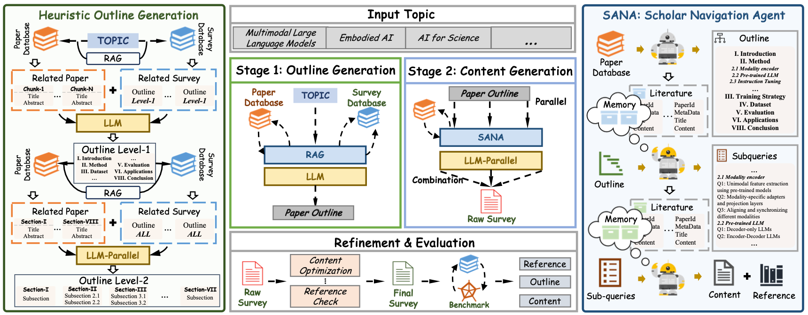

<div align="center">
<h1>(ACL-2025) SurveyForge: On the Outline Heuristics, Memory-Driven Generation, and Multi-dimensional Evaluation for Automated Survey Writing</h1>

[[ Paper 📓 ]](https://arxiv.org/abs/2503.04629) [[ SurveyBench Benchmark 🤗 ]](https://huggingface.co/datasets/U4R/SurveyBench)  [[SurveyForge Database 🤗]](https://huggingface.co/datasets/U4R/SurveyForge_database/tree/main)

<i>
🤩 Tired of chaotic structures and inaccurate references in AI-generated survey paper? <b>SurveyForge</b> is here to revolutionize your research experience!
</i>
</div>

# 🔥 News
  - <p style='text-align:justify'><i>Coming soon</i>: &nbsp;🎉🎉 Support the generation of comprehensive surveys in all fields on the online website.</p>

  - <p style='text-align:justify'><i>2025.06</i>: &nbsp;🎉🎉 We released the code of SurveyForge.</p>
  - <p style='text-align:justify'><i>2025.05</i>: &nbsp;🎉🎉 Congratulations: SurveyForge was accepted by ACL-2025 main conference.</p>

## Introduction

<p align="center">
  
  <!-- <div>The overview of SURVEYFORGE. The framework consists of two main stages: Outline Generation and Content Writing. In the Outline Generation stage, SURVEYFORGE utilizes heuristic learning to generate well-structured outlines by leveraging topic-relevant literature and structural patterns from existing surveys. In the Content Writing stage, a memory-driven Scholar Navigation Agent (SANA) retrieves high-quality literature for each subsection and LLM generates the content of each subsection. Finally, the content is synthesized and refined into a coherent and comprehensive survey.
</div> -->
</p>

Survey papers are vital in scientific research, especially with the rapid increase in research publications. Recently, researchers have started using LLMs to automate survey creation for improved efficiency. However, LLM-generated surveys often fall short compared to human-written ones, particularly in outline quality and citation accuracy. To address this, we introduce **SurveyForge**, which first creates an outline by analyzing the structure of human-written outlines and consulting domain-related articles. Then, using high-quality papers retrieved by our scholar navigation agent, **SurveyForge** can automatically generate and refine the content of the survey.

Moreover, to achieve a comprehensive evaluation, we construct **SurveyBench**, which includes 100 human-written survey papers for win-rate comparison and assesses AI-generated survey papers across three dimensions: reference, outline, and content quality.

## 🤔How to try out SurveyForge?
- First you need to download the database from [[SurveyForge Database]](https://huggingface.co/datasets/U4R/SurveyForge_database/tree/main).


- Then you need to download the embedding model from [[gte-large-en-v1.5]](https://huggingface.co/Alibaba-NLP/gte-large-en-v1.5/tree/main)


- Finally, configure your **API KEY** and **data path** in [code/run_demo.py](./code/run_demo.py) and run the command as follows:


```
cd code && python run_demo.py
```

## 🕵️‍♂️How to evaluate the quality of the survey paper?

We offer **SurveyBench**, a benchmark for **academic research** and **evaluating the quality of AI-generated surveys.**

[SurveyBench Download](https://huggingface.co/datasets/U4R/SurveyBench)

Currently , SurveyBench consists of approximately 100 human-written survey papers across 10 distinct topics, carefully curated by doctoral-level researchers to ensure thematic consistency and academic rigor. The supported topics and the core references corresponding to each topic are as follows:

| Topics                                                   | # Reference |
| -------------------------------------------------------- | :---------: |
| Multimodal Large Language Models                         |     912     |
| Evaluation of Large Language Models                      |     714     |
| 3D Object Detection in Autonomous Driving                |     441     |
| Vision Transformers                                      |     563     |
| Hallucination in Large Language Models                   |     500     |
| Generative Diffusion Models                              |     994     |
| 3D Gaussian Splatting                                    |     330     |
| LLM-based Multi-Agent                                    |     823     |
| Graph Neural Networks                                    |     670     |
| Retrieval-Augmented Generation for Large Language Models |     608     |

More support topics coming soon!

### 🧑‍💻You can evaluate the survey by:

```
cd SurveyBench && python test.py --is_human_eval
```

Note set `is_human_eval` True for human survey evaluation, False for generated surveys.

If you want to evaluate your method on SurveyBench, please follow the format:

```
generated_surveys
|-- 3D Gaussian Splatting
    |-- exp_1
        |-- ref.json
    |-- exp_2
        |-- ref.json
...
|-- Graph Neural Networks
...
```


## 📝Examples

| Topics                                                   | Links |
| -------------------------------------------------------- | :---: |
| Multimodal Large Language Models                         | [Comprehensive Survey on Multimodal Large Language Models Advances, Challenges, and Future Directions.pdf](demo_papers/Comprehensive%20Survey%20on%20Multimodal%20Large%20Language%20Models%20Advances,%20Challenges,%20and%20Future%20Directions.pdf) |
| 3D Object Detection in Autonomous Driving                | [Comprehensive Survey on 3D Object Detection in Autonomous Driving.pdf](demo_papers/Comprehensive%20Survey%20on%203D%20Object%20Detection%20in%20Autonomous%20Driving.pdf) |
| Vision Transformers                                      | [A Comprehensive Survey on Vision Transformers Foundations, Advances, Applications, and Future Directions.pdf](demo_papers/A%20Comprehensive%20Survey%20on%20Vision%20Transformers%20Foundations,%20Advances,%20Applications,%20and%20Future%20Directions.pdf) |
| Generative Diffusion Models                              | [Comprehensive Survey on Generative Diffusion Models Foundations, Innovations, and Applications.pdf](demo_papers/Comprehensive%20Survey%20on%20Generative%20Diffusion%20Models%20Foundations,%20Innovations,%20and%20Applications.pdf) |
| LLM-based Multi-Agent                                    | [Comprehensive Survey of Large Language Model-Based Multi-Agent Systems.pdf](demo_papers/Comprehensive%20Survey%20of%20Large%20Language%20Model-Based%20Multi-Agent%20Systems.pdf) |
| Self-Supervised Learning in Computer Vision              | [A Comprehensive Survey on Self-Supervised Learning in Computer Vision.pdf](demo_papers/A%20Comprehensive%20Survey%20on%20Self-Supervised%20Learning%20in%20Computer%20Vision.pdf) |
| Embodied Artificial Intelligence                         | [A Comprehensive Survey on Embodied Artificial Intelligence Foundations, Advances, and Future Directions.pdf](demo_papers/A%20Comprehensive%20Survey%20on%20Embodied%20Artificial%20Intelligence%20Foundations,%20Advances,%20and%20Future%20Directions.pdf) |
............


## Acknowledgements

We sincerely thank the [AutoSurvey](https://github.com/AutoSurveys/AutoSurvey) for laying the foundation in automated survey generation and analysis. SurveyForge is developed on top of the AutoSurvey framework, and we remain committed to continuous innovation and delivering ever more powerful, flexible solutions for automated survey research.

## Citations

```
@article{yan2025surveyforge,
  title={Surveyforge: On the outline heuristics, memory-driven generation, and multi-dimensional evaluation for automated survey writing},
  author={Yan, Xiangchao and Feng, Shiyang and Yuan, Jiakang and Xia, Renqiu and Wang, Bin and Zhang, Bo and Bai, Lei},
  journal={arXiv preprint arXiv:2503.04629},
  year={2025}
}
```


